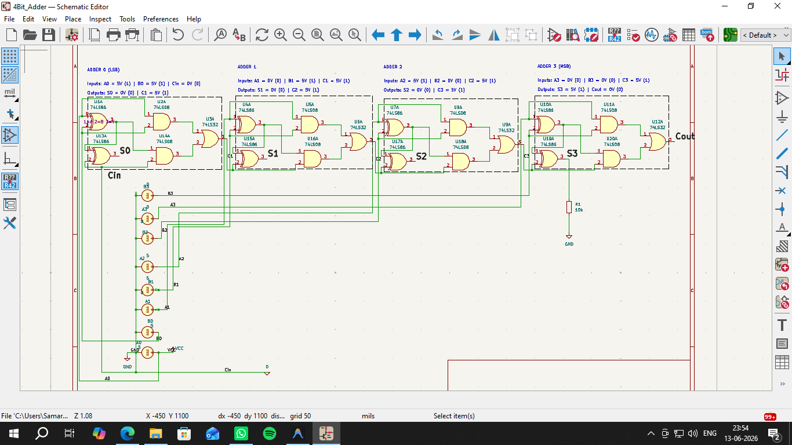
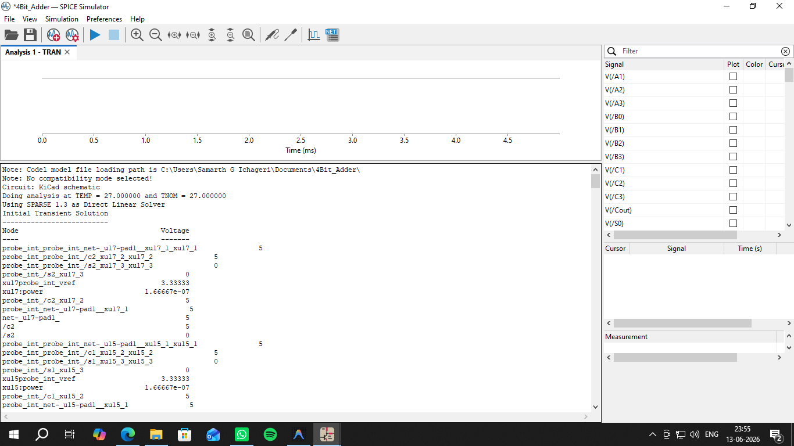

# 4-Bit Ripple Carry Adder: KiCad 74LS Simulation

## Overview

This repository contains a KiCad schematic and SPICE simulation of a 4-bit Ripple Carry Adder built from discrete 74LS-series logic gates. It demonstrates cascaded binary arithmetic and carry propagation by chaining four Full Adder stages and verifying the resulting sum and carry-out logic through transient SPICE analysis.

## Features

- 4-bit Ripple Carry Adder built from discrete 74LS86, 74LS08, and 74LS32 logic gates
- Manually bound SPICE behavioral models (`logic.lib`) for accurate gate-level simulation
- Configurable DC voltage sources to test arbitrary 4-bit input combinations
- Verified test case (5 + 3 = 8) with full node-voltage analysis

## Circuit Description

The adder cascades four Full Adder blocks, each accepting Bit A, Bit B, and a Carry-In (Cin), and producing a Sum bit and Carry-Out (Cout):

- **Sum Logic:** Sum = A ⊕ B ⊕ Cin, implemented with cascaded XOR gates.
- **Carry Logic:** Cout = (A · B) + (Cin · (A ⊕ B)), implemented with AND and OR gates.
- **Ripple Effect:** The Carry-Out of each stage feeds directly into the Carry-In of the next, from Adder 0 (LSB) through Adder 3 (MSB). Because higher-order bits cannot resolve until the carry has propagated through every preceding stage, this architecture is called a Ripple Carry Adder.

## Components

| Type | Component | Function |
|------|-----------|----------|
| Active | 74LS86 (Quad 2-input XOR) | Sum calculation |
| Active | 74LS08 (Quad 2-input AND) | Internal carry generation |
| Active | 74LS32 (Quad 2-input OR) | Carry propagation |
| Passive | 10 kΩ pull-down resistors | Stabilize logic states |
| Source | Multiple DC voltage sources | Constant Logic 1 (5 V) / Logic 0 (0 V) inputs |

> **EDA Note:** KiCad's standard 74-series symbols lack native SPICE math models, so the gates in this project are manually bound to behavioral models in `logic.lib`. All "Unit B" sub-gates are reassigned to "Unit A" to avoid SPICE indexing errors on multi-unit chips.

## Simulation Setup

1. Adder 0 (LSB) is wired first, handling bits A0/B0 with Cin grounded (Logic 0).
2. The Full Adder block is replicated three more times (Adder 1–3), with each stage's Carry-Out routed into the next stage's Carry-In.
3. Global VCC/GND power nets are assigned to power the hidden pins of the 74-series symbols.
4. Each logic gate's Simulation Model is manually bound to `logic.lib`.
5. DC voltage sources represent the binary input words: 5 V for Logic 1, 0 V for Logic 0.
6. Transient analysis is run as `.tran 0.1m 5m`, and node voltages are extracted for S0–S3 and Cout.

**Example Test Case — 5 + 3 = 8:**
- Input Word A (A₃A₂A₁A₀): 0101 (Decimal 5) → 0 V, 5 V, 0 V, 5 V
- Input Word B (B₃B₂B₁B₀): 0011 (Decimal 3) → 0 V, 0 V, 5 V, 5 V
- Initial Carry-In (Cin): 0 V

## Results

| Stage | Node / Net | Parameter | Expected Logic | Simulated Voltage | Status |
|-------|------------|-----------|------------------|---------------------|--------|
| Adder 0 (LSB) | S₀ | Sum Bit 0 | 0 | 0.0 V | PASS |
| | C₁ | Carry Out 0 | 1 | 5.0 V | PASS |
| Adder 1 | S₁ | Sum Bit 1 | 0 | 0.0 V | PASS |
| | C₂ | Carry Out 1 | 1 | 5.0 V | PASS |
| Adder 2 | S₂ | Sum Bit 2 | 0 | 0.0 V | PASS |
| | C₃ | Carry Out 2 | 1 | 5.0 V | PASS |
| Adder 3 (MSB) | S₃ | Sum Bit 3 | 1 | 5.0 V | PASS |
| | Cₒᵤₜ | Final Carry Out | 0 | 0.0 V | PASS |

**Final Output Binary:** 01000 (Decimal 8)

The carry bit successfully generated at Adder 0 and propagated through the entire 4-bit network, correctly resolving the MSB (S₃) and producing a mathematically accurate result for 5 + 3 = 8.

## Repository Structure

```
.
├── 4Bit_Adder.kicad_pro       # Main KiCad project file
├── 4Bit_Adder.kicad_sch       # Schematic and SPICE directives
├── 4Bit_Adder.kicad_pcb       # PCB layout file
├── logic.lib                  # Behavioral SPICE models for 74LS gates
├── logic.txt                  # Logic model reference notes
├── 4bit_Adder_Schematic.png   # Circuit schematic
├── 4bit_Adder_Output.png      # Simulation waveform/output
└── README.md
```

## How to Run

1. Clone this repository, ensuring `logic.lib` is included (the simulation will fail without it):
   ```bash
   git clone https://github.com/satvikpandurangi/4bit-Ripple-Carry-Full-Adder-Simulation-Kicad.git
   ```
2. Open `4Bit_Adder.kicad_pro` in the KiCad Project Manager.
3. Open the Schematic Editor to view the circuit layout.
4. Modify the DC voltage sources (A0–A3, B0–B3) to set your desired binary test case.
5. Go to **Inspect > Simulator** and click **Run/Stop Simulation**.
6. Probe the S0–S3 and Cout nets and compare against the binary addition truth table.

## Screenshots

**Schematic:**



**Simulation Output:**



